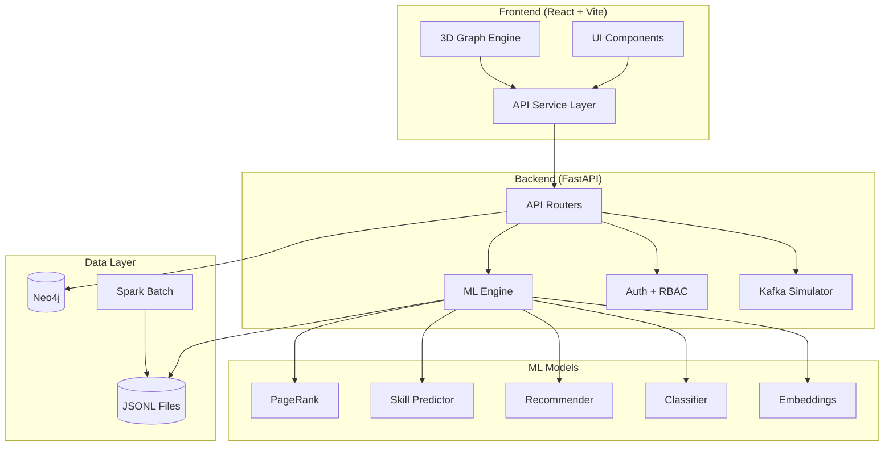
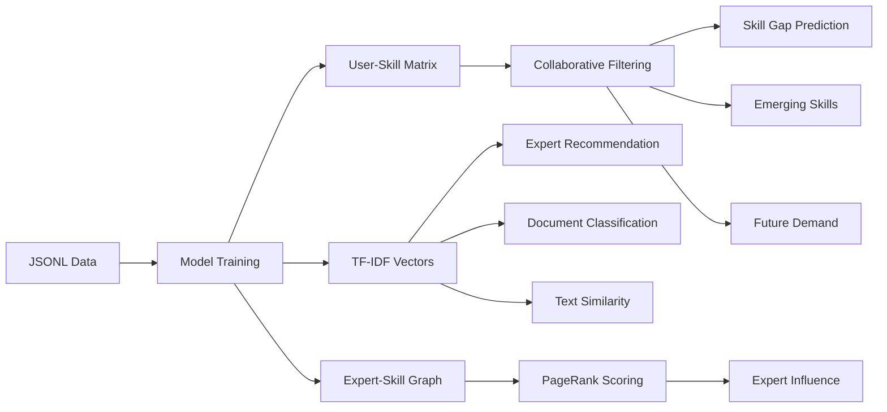
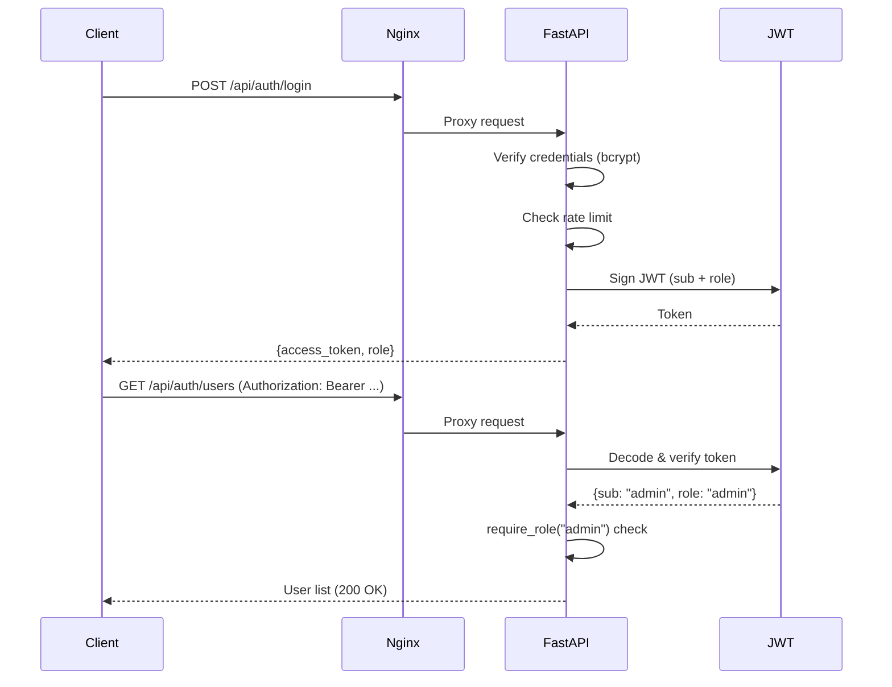

# Nexora — System Architecture

## Data Flow Overview



## Request Lifecycle

```
Client → Nginx (port 3000)
  ├─ /api/* → Proxy → FastAPI (port 8000) → Neo4j/ML/JSONL
  └─ /*     → React SPA (index.html fallback)
```

## ML Pipeline Architecture



## Authentication & RBAC Flow



## Big Data Pipeline

```mermaid
graph LR
    subgraph Ingestion["Kafka Simulator"]
        EVT[Events] --> QUEUE[Event Queue]
        QUEUE --> PROC[Processor]
        PROC --> METRICS[Metrics]
    end

    subgraph Batch["Spark Batch Job"]
        JSONL[JSONL Files] --> SPARK[PySpark / Python]
        SPARK --> SK_A[Skill Analytics]
        SPARK --> DOC_A[Document Analytics]
        SPARK --> EXP_A[Expert Rankings]
        SPARK --> DEPT_A[Department Analytics]
        SPARK --> PROJ_A[Project Analytics]
    end

    SK_A & DOC_A & EXP_A & DEPT_A & PROJ_A --> OUTPUT[spark/output/*.json]
    OUTPUT --> BIGDATA_API[/api/bigdata/* endpoints]
```

## Deployment Architecture (Docker)

```
docker-compose.yml
├── neo4j (port 7474, 7687)
│   └── Persistent volume: neo4j_data
├── backend (port 8000)
│   ├── FastAPI + Uvicorn
│   ├── Mounts: ./data → /app/data
│   └── Depends: neo4j (healthcheck)
└── frontend (port 3000 → 80)
    ├── Build: Node 20 → Nginx Alpine
    ├── SPA routing + API proxy
    └── Depends: backend
```

## Neo4j Schema

| Node | Properties |
|------|-----------|
| Expert | id, name, email, department, role, location, experience_years, expertise_level |
| Skill | id, name, category, level, demand |
| Document | id, title, type, topic, content, author, date, views, rating |
| Project | id, name, domain, tech_stack, status, budget, priority |

| Relationship | Direction |
|-------------|-----------|
| HAS_SKILL | Expert → Skill |
| WORKS_ON | Expert → Project |
| AUTHORED | Expert → Document |
| KNOWS | Expert → Expert |
| REQUIRES_SKILL | Project → Skill |
